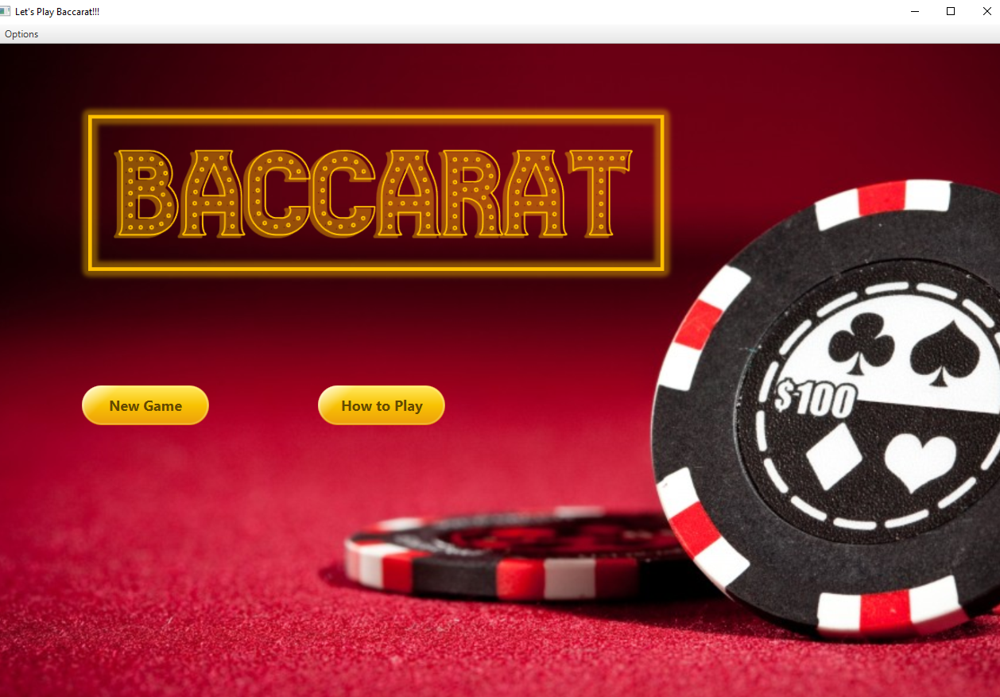
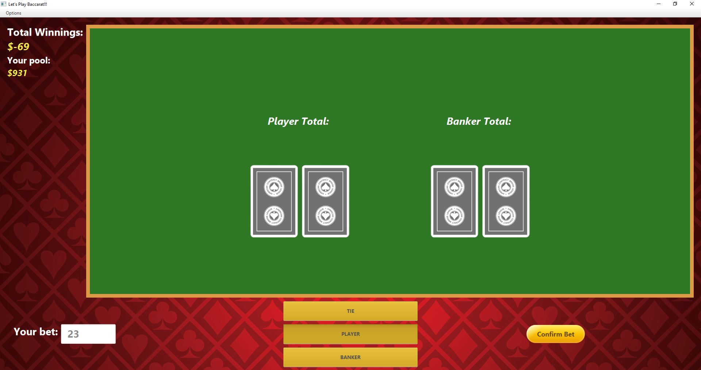
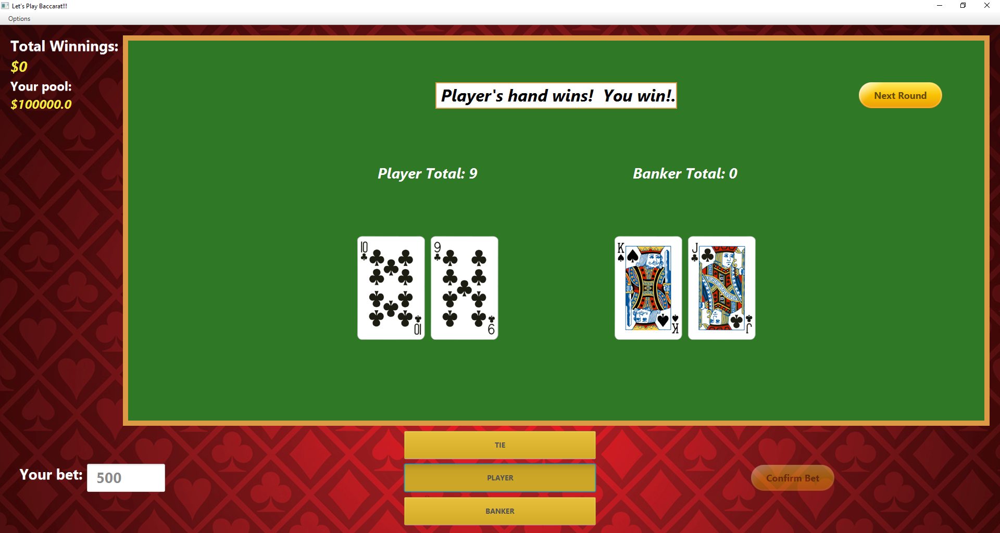

# Baccarat

### Description

Simple Baccarate simulator using JavaFX and Maven. The placer can pick their choice from a preset set of pools and bet on either the player, the banker or on a tie. Game ends when the player's pool reaches zero or when the user quits the program.

### Screenshots

